
<h1 align="center">的校园二手交易网站</h1>

## 简介
校园二手交易网站：角色分为管理员、用户和商家；支持商品发布、浏览、搜索和管理；包含支付选择、订单处理、用户管理、留言反馈等功能模块。    --计算机毕业设计源码；毕设源码；java毕业设计源码

## 联系方式

<h3 align="center">获取完整代码与数据库文件 + 微信：deepguan QQ: 86050149 QQ群: 783742310</h3>

<h3 align="center">可帮忙远程部署 包运行成功！提供远程部署、修改代码、设计文档指导、代码讲解等服务！</h3>

## 功能介绍（完整见运行截图）
管理员：基本功能包括用户和商家的注册、登录和退出，通过管理后台可以进行用户管理、商品类型管理、商品信息管理、订单管理、留言板管理和系统管理等。商品管理模块允许查看、修改和删除商品信息，同时提供搜索和分页功能。管理员还可以处理用户的留言，通过客服聊天功能进行回复。系统设计简洁明确，旨在提供高效的管理体验。

商家：在平台中扮演商品提供者的角色，需通过注册和登录来管理个人及店铺信息。在商品信息管理模块，他们可以发布和修改商品信息，并处理订单发货。提供上传商品图片、填写商品详情、价格的功能来吸引买家，通过与买家联系、处理交易记录和发货管理，商家可以简化其交易流程，提升业务效率。

用户：需注册账户后，登录进入系统进行商品浏览和购买操作。可以使用分类导航和搜索栏快速找到感兴趣的商品，并查看商品详情及价格信息。在个人中心，用户可以更新个人信息、查看自己的订单、管理收货地址及购物记录。方便的支付选项包括微信支付、支付宝及多家银行服务，确保用户交易的便捷和安全。

游客：作为未注册的访问者，可以浏览网站首页所提供的商品信息、新闻资讯及留言反馈等内容，通过首页的导航栏快速进入不同模块。游客在对网站产生兴趣后，可进行用户或商家的身份选择注册，从而进一步进入平台的交易和管理系统。网站设计充分考虑访问者的交互体验，页面布局清晰，操作简单直观，有效吸引用户加入。

## 运行截图

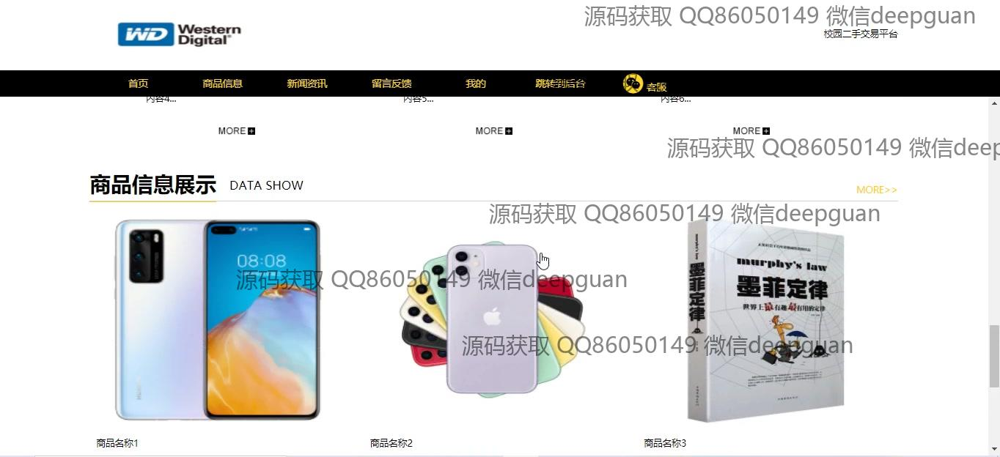
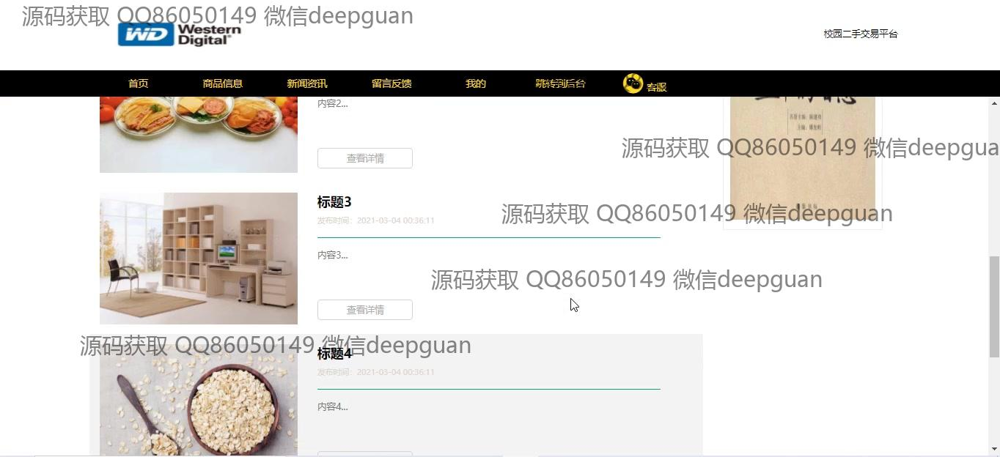
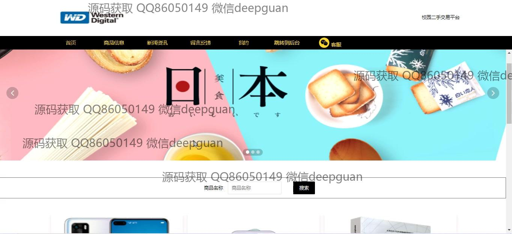
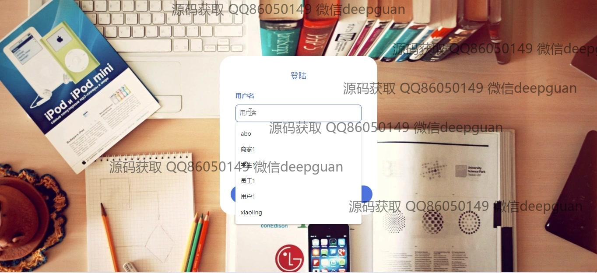
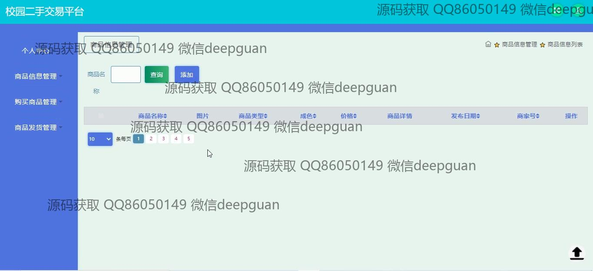
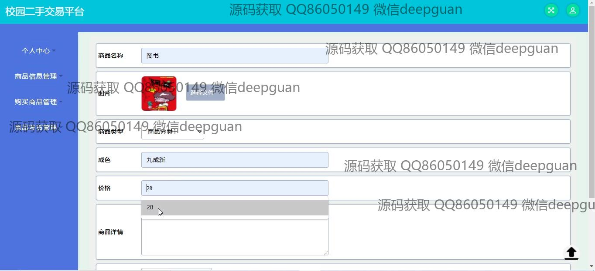
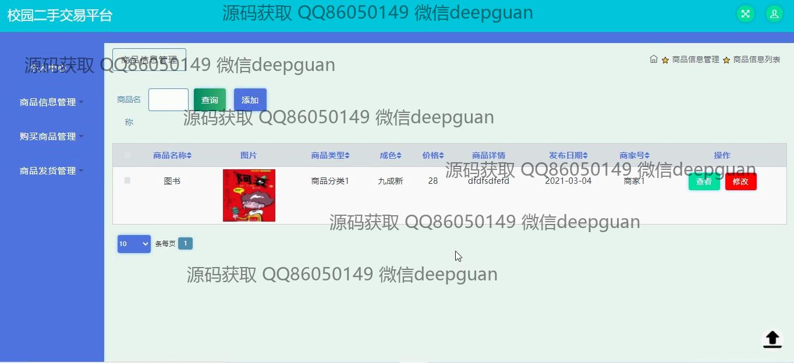
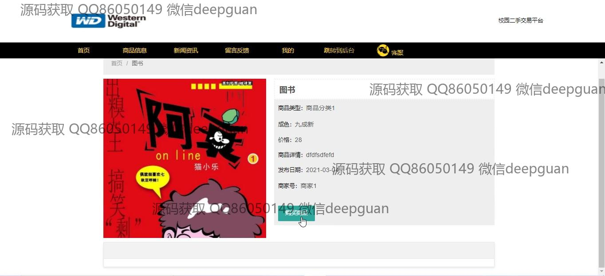
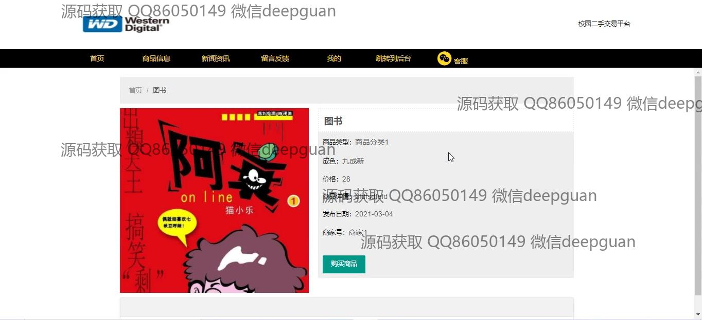
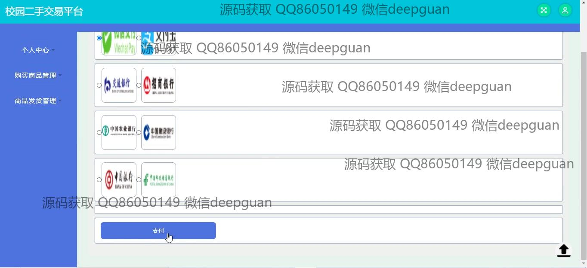
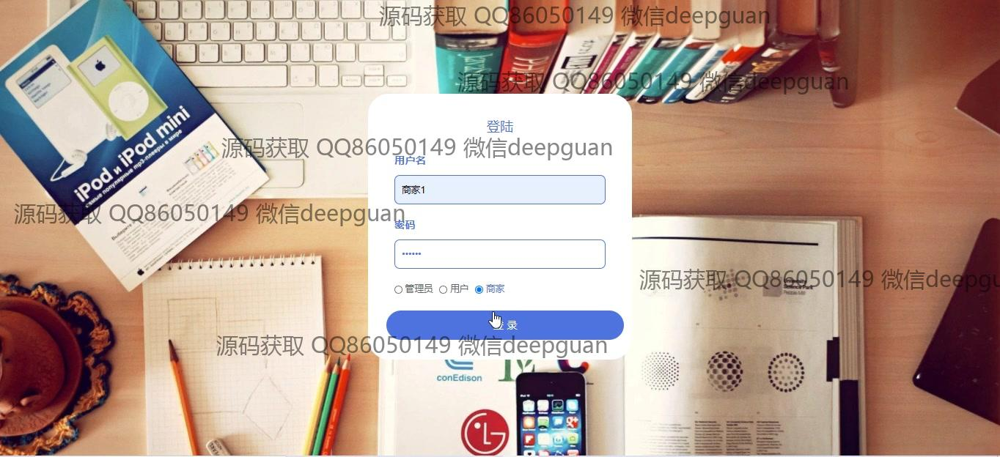
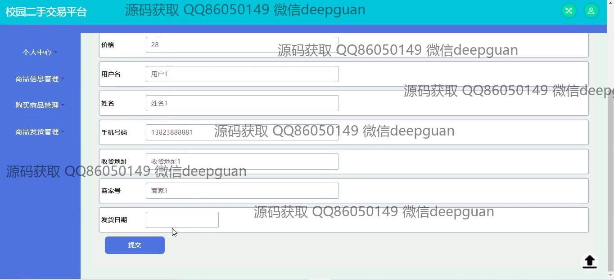
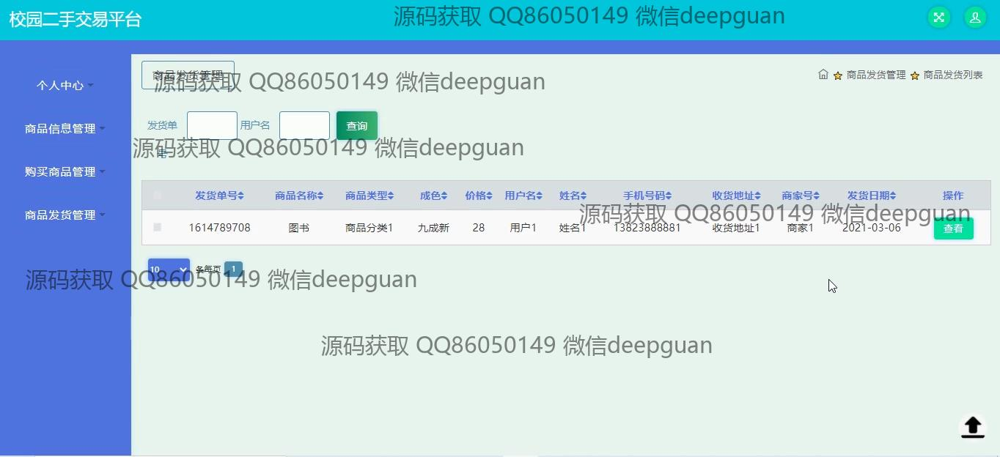
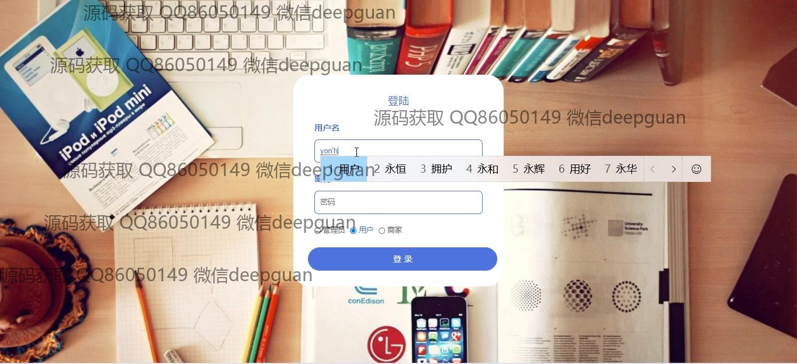
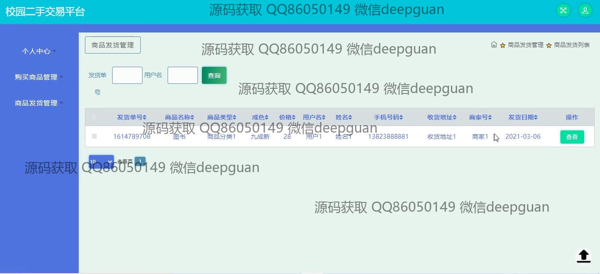
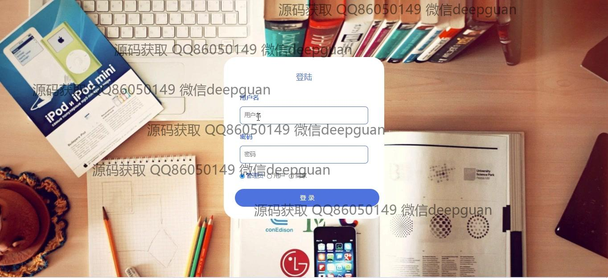
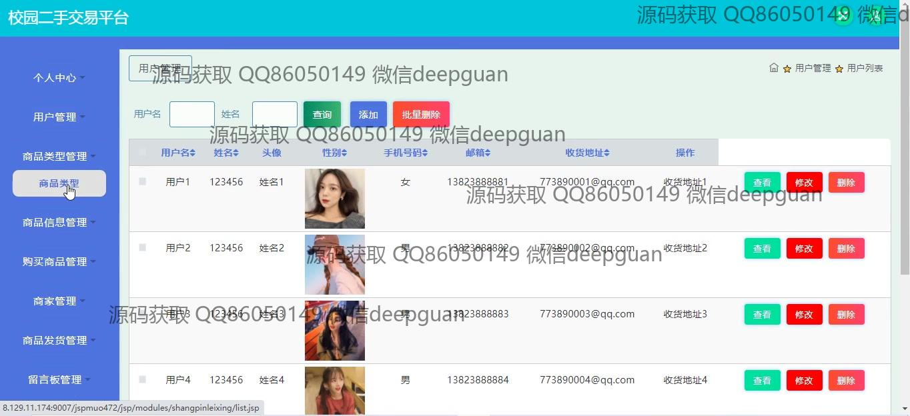
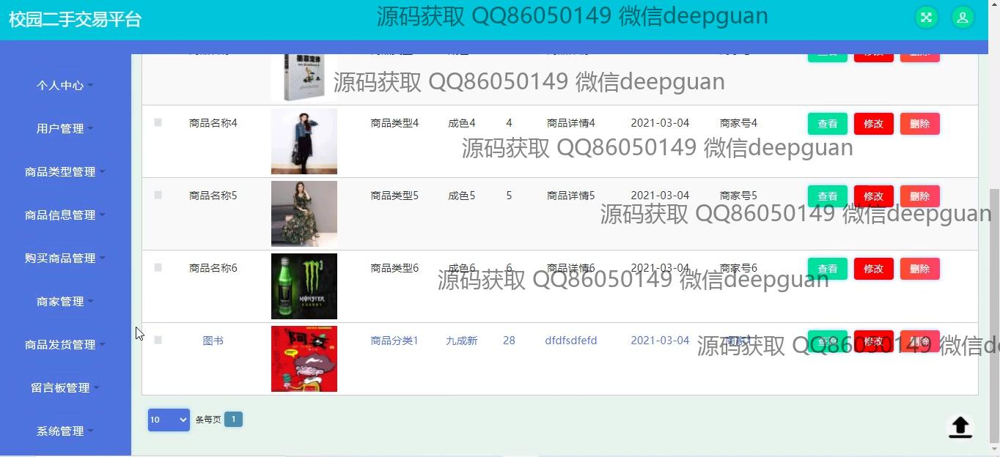
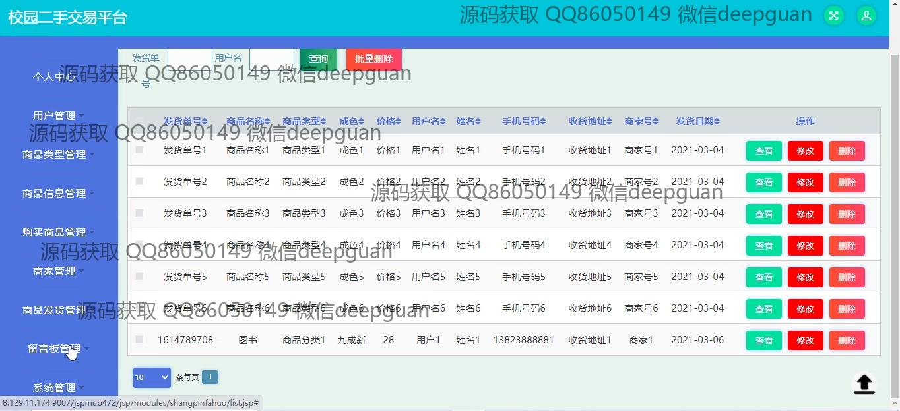
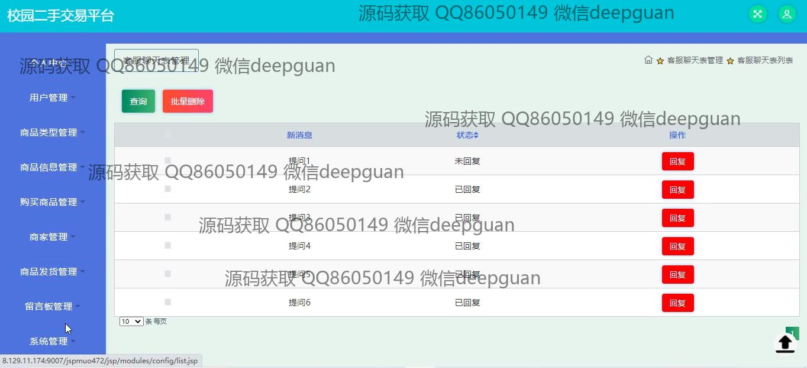
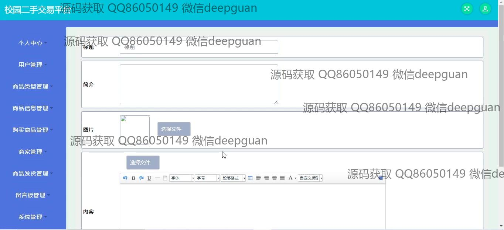

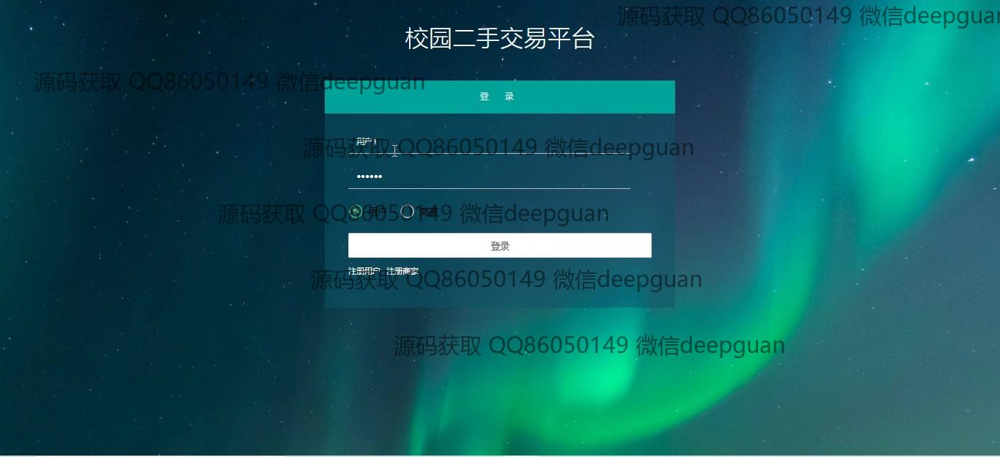

本代码来源于网络,仅供学习参考使用!

